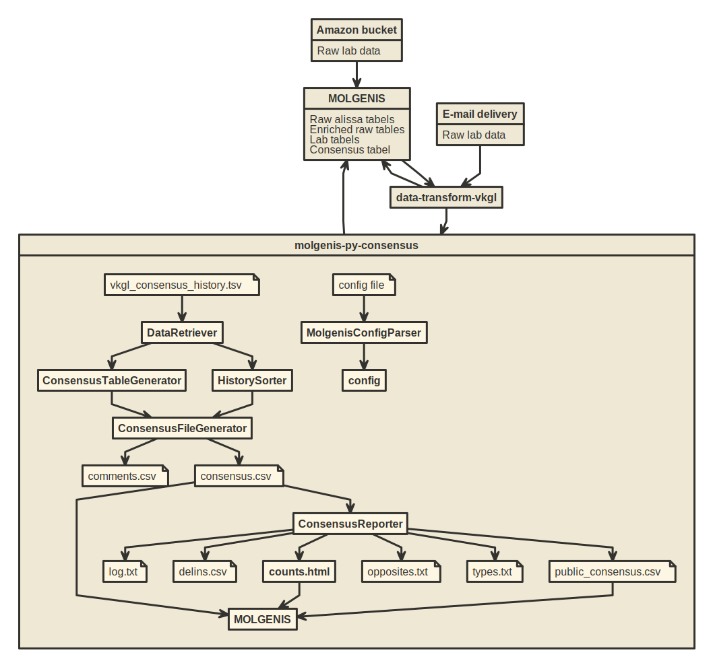
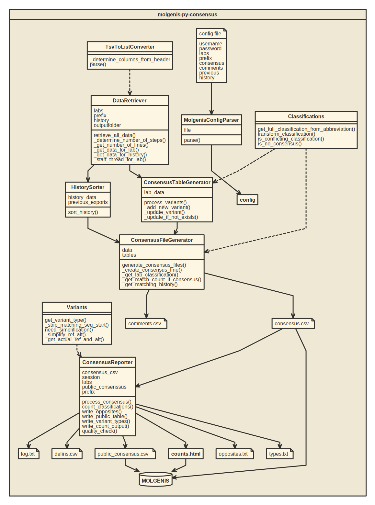

# molgenis-py-consensus
This pipeline generates the consensus table for the VKGL project, but can be used for every project
with the same data structure.

## Prerequisites for entire VKGL export
- Molgenis 7.0 or higher
- EMX file in `emx` directory is imported in molgenis
- Install MOLGENIS commander
- Add the output folder of this tool to the `mcmd` config to the dataset_folders
- Copy the `mcmd` scripts from the `mcmd_scripts` directory to the `.mcmd/scripts` folder on your machine
- Set `import_action` in `settings` section of `mcmd.yaml` to `add`
- Set config file (see below)

## Prerequisites for pipeline
- Lab tables are filled (for pre-processing raw data see next paragraph)
- Python 3 (tested on 3.7)  
  Python libraries: 
  - `molgenis-py-client (v2.1.0 or higher)`
  - `termcolor (v1.1.0)`
  - `yaspin (v0.14.3)`
  - `progressbar2 (v3.39.3)`
  
## Config
In order to run the scripts, a config file should be added to the folder in which the pipeline is located. The 
configfile called `config.txt` should be placed in the `config` directory. Its content should like this:
```
username=yourusername
password=yourpassword
labs=lab1,lab2,lab3
prefix=vkgl_
consensus=consensus
server=http://yourserver/api/
comments=consensus_comments
previous=1805,1810
history=consensus_history
output=/your/output/dir/
input=/your/input/dir/
```

### Prefix
The prefix is the characters that are always prepended to a table name in order to get the fully
qualified name (usually this is the package name).

### Labs
Labs is a comma separated list of the labs that should be processed into the consensus table. 
Naturally these names should be the same as the name of the table that contains the data, for 
instance: when specifying `umcg` the data is stored in the `vkgl_umcg` table. 

### Consensus, Comments, and History
The name of the consensus, comments and history table, without the prefix.

### Server
The URL of the API of your server. Don't forget to add the `/api/` behind your URL.

### Previous
A list of numbers representing the previous exports in order to append the history. In this case
we had an export in May 2018 and October 2018, which resulted in `1805,1810`. 
 
## Summary

  
## 1. Pre-processing raw data
Firstly the tables as delivered by the labs should be transformed into one uniform format. This can be achieved using 
the following pipeline:
[https://github.com/molgenis/data-transform-vkgl](https://github.com/molgenis/data-transform-vkgl).
This pipeline will transform several data formats to the generic VKGL data model. The data formats are described below.

### Alissa format
The header of the tab separated file contains the following values: `"timestamp", "id", "chromosome", "start", "stop", 
"ref", "alt", "gene", "transcript", "c_nomen", "p_nomen", "exon", "variant_type", "location", "effect", 
"classification", "last_updated_by", "last_updated_on"`. Except from `"timestamp"` and `"id"`, these are the columns as 
delivered from Alissa Interpret. They are first imported into MOLGENIS using the "Amazon bucket file ingest"
feature in the [MOLGENIS scheduled jobs plugin](https://molgenis.gitbooks.io/molgenis/content/guide-schedule.html).
From there the files are downloaded as csv and then converted into tab delimited (.txt) files and put into the inbox folder of the pipeline.
Before starting the file ingest make sure that the vkgl_raw_"labname" are empty.

### Radboud/MUMC format
The filename must contain the word "radboud". It is a tab separated file without a header, it should contain columns in
the following order: `"chromosome", "start", "stop", "ref", "alt", "gene", "transcript", "protein", empty column,
"exon", "empty column", "classification"`. 

### LUMC format
A tab separated file with the following columns: `"refseq_build", "chromosome", "gDNA_normalized", "variant_effect", 
"geneid", "cDNA", "Protein"`.

### Run the pipeline  
Remove the error files of the last export from the result folder. Run `MySpringBootApplication` in `IntelliJ` or if you don't have `IntelliJ` installed, run `mvn clean spring-boot:run` (runs only with Java8) and place 
the lab files one by one in the inbox (place the next if the previous one is reported to be done). After running the 
pipeline several files will be produced for each lab: 

| File                      | Description                                                                       |
|---------------------------|---------------------------------------------------------------------------------- |
|`vkgl_*labname*.tsv`       | File with the data mapped to the generic VKGL data model                          |
|`*labname*.txt`            | File with the raw data plus the columns generated by the pipeline                 |
|`vkgl_*labname*_error.txt` | File with the errors that were filtered out because they are invalid or duplicate |

Now it's time to cleanup the tables with raw data in your MOLGENIS instance:
```
mcmd run vkgl_cleanup_raw_labs
```

The raw files should be renamed to: `vkgl_raw_*labname*_v2.tsv` and placed in the `output` folder of this tool 
(`molgenis-py-consensus`). Upload them:
```
mcmd run vkgl_upload_raw_labs
```

The `vkgl_*labname*.tsv`
should be moved to the `input` folder of this tool (`molgenis-py-consensus`). The error file can be send to the labs
after the export is done.

Now go to the `preprocessing` folder of this tool and run `PreProcessor.py`. Make sure your config file is correctly 
set. This script creates the file `vkgl_comments.tsv` in the output folder of the pipeline. 

## 2. Add last export to history table
At this point, please make sure you transported the lines of the previous consensus table to the
history table. To do so, do the following.

1. Download the data of your current consensus table and consensus comments table using either the 
[EMX downloader](https://github.com/molgenis/molgenis-tools-emx-downloader) or the download feature in the navigator.
2. Save the consensus table as tab separated file named `vkgl_consensus20*yymm of previous export*.tsv`.
3. Save the consensus comments table as separated file named `vkgl_consensus_comments20*yymm of previous export*.tsv`.
4. Run the `HistoryWriter.py` in the `preprocessing` directory.
5. Import the history:
```
mcmd import vkgl_consensus_history.tsv
```
Make sure it's uploaded by checking in your MOLGENIS.

## 3. Cleanup and upload
It's nice to put a warning message on the homepage (edit `home` row in `sys_StaticContent` table) of the server. 
Something like this (Bootstrap 3, MOLGENIS 7.x, for 8.x remove the glyphicon):
```html
<div class="row">
    <div class="col-md-12">
        <div class="alert-warning">
            <span class="glyphicon glyphicon-exclamation-sign" aria-hidden="true"></span>
            We are currently working on the new VKGL export, therefore some data might be missing. As soon as this 
            message is gone, the updated version will be available. We thank you for your understanding and patience.
        </div>
    </div>
</div>
```
Now it's time to cleanup your previous consensus export:
```
mcmd run vkgl_cleanup_consensus
mcmd run vkgl_cleanup_labs
mcmd delete --data vkgl_comments -f
``` 
And now upload the comments and lab data we already generated:
```
mcmd import vkgl_comments.csv
```
| WARNING: If you get an error telling you have a duplicate value at this point, there's hash collision! |
| --- |
To fix this, go to the `PreProcessor.py` and increase the number of characters to be returned from the hashed id, keep
it as short as possible to keep the performance in MOLGENIS as good as possible.
```python
def _get_id(variant_id, lab):
    prefix = lab.upper().replace('_', '') + '_'
    # Get first 10 of hash
    return prefix + variant_id[0:10]
``` 
Now import the lab data:
```
mcmd run vkgl_import_labs
```

## 4. Running the script
Once the config file is specified and the lab tables are populated, make sure you have initialized 
a virtual environment:
```
python3 -m virtualenv env
```

Now the script should be able to run easily using the following command:
```
source env/bin/activate
pip install -e .
python3 consensus
```
The script will keep you posted on its progress. The main steps of the process are:
1. Retrieving data (of the labs and the history table)
2. Processing variants
3. Deleting the old consensus table (might take a while)
4. Deleting the old comments table (might take a while)
5. Writing the consensus table to file (the more history the longer this takes, with 2 rounds of history +/- 45 minutes)
6. Generating reports:
    - Counts of the classifications in counts.html (to be placed on a Molgenis static content page)
    - Public consensus (will automatically upload)
    - A text file with opposites (opposites_report_yymm.txt)
    - A text file with counts per variant type (in types.txt)
    
Typically the script runs for approximately two hours until it finishes (for three batches of history).

## Uploading and finishing
```
mcmd import vkgl_consensus_comments.csv
mcmd import vkgl_consensus.csv
```
Delete the public consensus and upload a new one:
```
mcmd delete --data vkgl_public_consensus
mcmd import vkgl_public_consensus.csv
```

Convert this file to VCF using the [vkgl-vcf-converter](https://github.com/molgenis/vkgl-vcf-converter). 

Put the CSV and VCF file on the download server and update the downloads page (`background` row of `sys_StaticContent`).

Copy the content of `counts.html` to the counts page (`news` row of `sys_StaticContent`).

Remove message from homepage.

Report to the labs that the export is finished, let them know which errors were found for their lab and which conflicts
(`vkgl_opposites_report_*yymm of export*.txt`) were found in the consensus table.

Send the raw Radboud/MUMC file and the raw files from the `Alissa` labs to LUMC to update LOVD and LOVD+.

## Checklist
This export is a whole process. To make sure everything is done, use this checklist:
- [ ] Delete data from vkgl_raw_'lab' tables in MOLGENIS:
    - [ ] AMC
    - [ ] Erasmus
    - [ ] LUMC
    - [ ] NKI
    - [ ] Radboud/MUMC
    - [ ] UMCG
    - [ ] UMCU
    - [ ] VUMC
- [ ] Download Alissa files to MOLGENIS
    - [ ] AMC
    - [ ] Erasmus
    - [ ] NKI
    - [ ] UMCG
    - [ ] UMCU
    - [ ] VUMC
- [ ] Import LUMC and Radboud/MUMC data into vkgl_raw_'lab' tables in MOLGENIS (not obligated)   
- [ ] Download raw tables from MOLGENIS
- Process raw data for each lab:
    - [ ] AMC
    - [ ] Erasmus
    - [ ] LUMC
    - [ ] NKI
    - [ ] Radboud/MUMC
    - [ ] UMCG
    - [ ] UMCU
    - [ ] VUMC
- [ ] Cleanup raw tables (`mcmd`)
- [ ] Upload enriched raw tables (`mcmd`)
- [ ] Download current consensus and consensus comments
- [ ] Generate history
- [ ] Upload history (`mcmd`)
- [ ] Put message on homepage
- [ ] Delete data of current consensus and consensus comments (`mcmd`)
- [ ] Delete data of current labs (`mcmd`)
- [ ] Delete data of current lab comments (`mcmd`)
- [ ] Upload new lab comments (`mcmd`)
- [ ] Upload new lab data (`mcmd`)
- [ ] Run the consensus script
- [ ] Upload consensus comments (`mcmd`)
- [ ] Upload consensus (`mcmd`)
- [ ] Delete data of current public consensus (`mcmd`)
- [ ] Upload public consensus (`mcmd`)
- [ ] Make VCF of public consensus
- [ ] Put CSV and VCF on download server
- [ ] Update downloads page
- [ ] Update counts page
- [ ] Remove message from homepage
- [ ] Report back to labs

## Running tests
For the complex code functionality tests have been added. To run the tests run the following command
in your virtual environment:
```
python3 setup.py test
```

## Testing integration of pipeline
To test this pipeline:
1. Upload the `test_data/test_emx.xlsx` in Molgenis via the advanced importer.
2. Place the content of the `config.txt` in the config directory by the content of `test_data/test_config.txt`.
3. Run the script (after initializing virtual environment, see "Running the script"):
```
source env/bin/activate
pip install -e .
python3 consensus
```

## Pipeline flow diagram



## Pipeline code diagram

